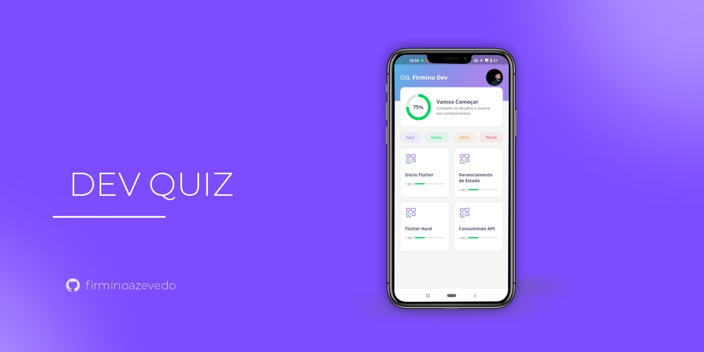
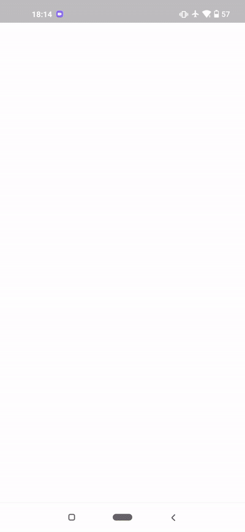

# dev_quiz
<p align="center">
Este projeto foi desenvolvido na Next Level Week, uma semana intensa de estudos, networking, amizade, trabalho em grupo, acompanhada por um projeto sensacional desenvolvido pela Rocketseat de 19 a 25 de abril.
Esta aplicação pretende ser um Quiz para que os programadores intensifiquem os seus conhecimentos em programação através dos exercícios propostos pela aplicação, onde tem interactividade de questões e respostas.
É um projeto básico até agora, mas abre muitas portas para ideias, funcionalidades, parcerias e muito aprendizado que levarei para o meu profissional. Mais uma semana de NLW foi concluída com sucesso e com muita presença na comunidade, ajudando outras pessoas e tirando dúvidas das mesmas. Foi incrível!
</p>
<br>

<h2 align="center">Layout 🎨</h2>

   <p align="center">
      O layout foi desenvolvido por <a href="https://instagram.com/tiagoluchtenberg">Tiago Luchtenberg</a>, e você pode acessa-lo no Figma:

   - <a href="https://www.figma.com/file/XaC3pgD1B0iLSWLTsUqxIe/DevQuiz-(Copy)?node-id=0%3A1">Mobile</a> 📱

   <p align="center">
    
    
   </p>
   </p>

   ## Packages utilizados

| Nome do Pacote | Descrição                             |
| -------------- | ------------------------------------- |
| google_fonts   | Permite adicionar novas fontes ao app |
| share_plus     | Compartilha o resultado em outros app |


<h2 align="center"> ⚠️ Requisitos </h2>

Você deve ter instalado Flutter e Dart em sua máquina. Para isso, consulte o guia de instalação em: https://flutter.dev/docs/get-started/install

<h2 align="center"> Como Usar 🤔</h2>

   ```
   
   - Clone este repositório:
   $ git clone https://github.com/firminoazevedo/devquiz

   - entre no diretório:
   $ cd devquiz

   - Para instalar as dependências:
   $ flutter pub get

   - Para iniciar o app: 
   $ flutter run
   ```


<h2 align="center">Como Contribuir 💪</h2>

   ```
   - Fork o projeto 

   - Cria uma nova branch com suas mudanças:
   $ git checkout -b my-feature

   - Salve suas mudanças e crie uma mensagem de commit falando o que fez:
   $ git commit -m "feature: My new feature"

   - Envie suas mudanças:
   $ git push origin my-feature
   ```

---


Feito com :heart: por [Firmino Neto](https://github.com/firminoazevedo) 🚀